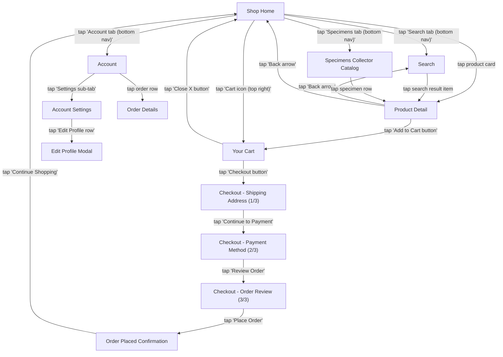

# App Explorer Report: Bug Bazaar

**Platform:** Ios | **Date:** 2026-04-12

## Summary

| Metric | Value |
|--------|-------|
| Screens discovered | 13 |
| Transitions mapped | 19 |
| Interactive elements | 68 |
| Elements explored | 0 (0%) |

## Navigation Map

## Screen Inventory

### 1. Shop Home (`shop-home`)

**Elements:**
- Cart icon (green, top right) (icon) (unexplored)
- All Bugs category tab (tab) (unexplored)
- Beetles category tab (tab) (unexplored)
- Butterflies category tab (tab) (unexplored)
- Moths category tab (tab) (unexplored)
- Hercules Beetle product card (list_item) (unexplored)
- Blue Morpho product card (list_item) (unexplored)
- Orchid Mantis product card (list_item) (unexplored)
- Gold Tortoise product card (list_item) (unexplored)
- Hercules Beetle add to cart button (button) (unexplored)
- Search tab (bottom nav) (tab) (unexplored)
- Specimens tab (bottom nav) (tab) (unexplored)
- Account tab (bottom nav) (tab) (unexplored)

---

### 2. Search (`search`)

**Elements:**
- Search input field (input) (unexplored)
- Beetle trending tag (button) (unexplored)
- Rare trending tag (button) (unexplored)
- Spider trending tag (button) (unexplored)
- Moth trending tag (button) (unexplored)
- Hercules Beetle list item (list_item) (unexplored)
- Blue Morpho list item (list_item) (unexplored)
- Orchid Mantis list item (list_item) (unexplored)
- Gold Tortoise list item (list_item) (unexplored)

---

### 3. Specimens Collector Catalog (`specimens`)

**Elements:**
- Beetles section header (button) (unexplored)
- Hercules Beetle specimen row (list_item) (unexplored)
- Gold Tortoise specimen row (list_item) (unexplored)
- Goliath Beetle specimen row (list_item) (unexplored)
- Stag Beetle specimen row (list_item) (unexplored)
- Butterflies section (collapsed) (button) (unexplored)
- Moths section (collapsed) (button) (unexplored)
- Spiders section (collapsed) (button) (unexplored)
- Crawlers section (collapsed) (button) (unexplored)

---

### 4. Account (`account`)

**Elements:**
- Orders sub-tab (tab) (unexplored)
- Settings sub-tab (tab) (unexplored)
- Bug Collector profile section (button) (unexplored)

---

### 5. Account Settings (`account-settings`)

**Elements:**
- Edit Profile row (button) (unexplored)
- Shipping Addresses row (button) (unexplored)
- Payment Methods row (button) (unexplored)
- Notifications row (button) (unexplored)
- Help & Support row (button) (unexplored)
- Log Out button (button) (unexplored)

---

### 6. Product Detail (`product-detail`)

**Elements:**
- Back arrow (top left) (icon) (unexplored)
- Add to Cart button (green) (button) (unexplored)
- Gold Tortoise related specimen (list_item) (unexplored)

---

### 7. Your Cart (`cart`)

**Elements:**
- Close X button (top left) (icon) (unexplored)
- Remove item X button (icon) (unexplored)
- Decrease quantity button (minus) (button) (unexplored)
- Increase quantity button (plus) (button) (unexplored)
- Checkout button (orange) (button) (unexplored)

---

### 8. Checkout - Shipping Address (1/3) (`checkout-shipping`)

**Elements:**
- Back arrow (icon) (unexplored)
- Full Name input (input) (unexplored)
- Street Address input (input) (unexplored)
- City input (input) (unexplored)
- ZIP input (input) (unexplored)
- Use saved address button (button) (unexplored)
- Continue to Payment button (button) (unexplored)

---

### 9. Checkout - Payment Method (2/3) (`checkout-payment`)

**Elements:**
- Back arrow (icon) (unexplored)
- Card Number input (input) (unexplored)
- Expiry input (input) (unexplored)
- CVV input (input) (unexplored)
- Name on Card input (input) (unexplored)
- Use demo card button (button) (unexplored)
- Review Order button (button) (unexplored)

---

### 10. Checkout - Order Review (3/3) (`checkout-review`)

**Elements:**
- Back arrow (icon) (unexplored)
- Place Order button (green) (button) (unexplored)

---

### 11. Order Placed Confirmation (`order-confirmation`)

**Elements:**
- Continue Shopping button (green) (button) (unexplored)
- View Orders button (black) (button) (unexplored)

---

### 12. Edit Profile Modal (`edit-profile-modal`)

**Elements:**
- OK button (button) (unexplored)

**Notes:** Demo feature - shows alert dialog only

---

### 13. Order Details (`order-detail`)

**Elements:**
- Back arrow (icon) (unexplored)

---

## User Paths

1. Shop Home -> Search -> Product Detail -> Your Cart -> Checkout - Shipping Address (1/3) -> Checkout - Payment Method (2/3) -> Checkout - Order Review (3/3) -> Order Placed Confirmation
2. Shop Home -> Specimens Collector Catalog -> Product Detail -> Your Cart -> Checkout - Shipping Address (1/3) -> Checkout - Payment Method (2/3) -> Checkout - Order Review (3/3) -> Order Placed Confirmation
3. Shop Home -> Specimens Collector Catalog -> Product Detail -> Search
4. Shop Home -> Account -> Account Settings -> Edit Profile Modal
5. Shop Home -> Account -> Order Details
6. Shop Home -> Product Detail -> Your Cart -> Checkout - Shipping Address (1/3) -> Checkout - Payment Method (2/3) -> Checkout - Order Review (3/3) -> Order Placed Confirmation
7. Shop Home -> Product Detail -> Search
8. Shop Home -> Your Cart -> Checkout - Shipping Address (1/3) -> Checkout - Payment Method (2/3) -> Checkout - Order Review (3/3) -> Order Placed Confirmation

## Edge Cases

| Screen | Title | Notes |
|--------|-------|-------|
| `edit-profile-modal` | Edit Profile Modal | Demo feature - shows alert dialog only |
